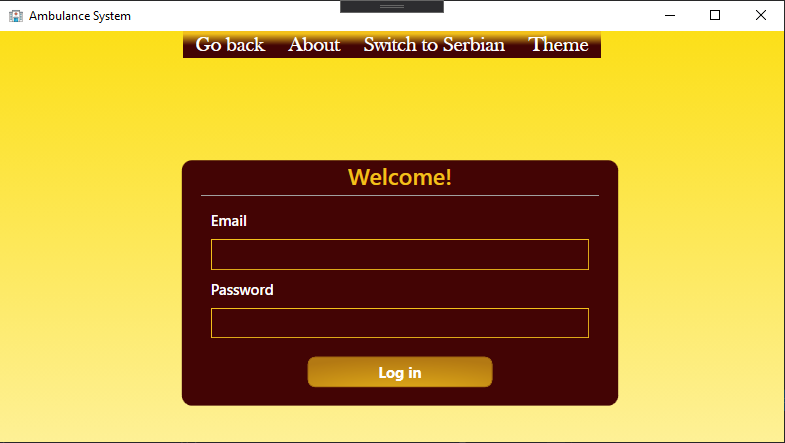
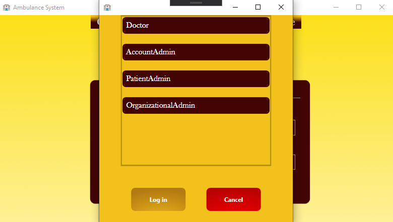
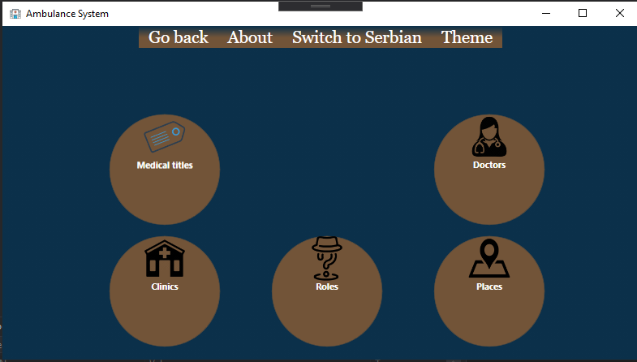
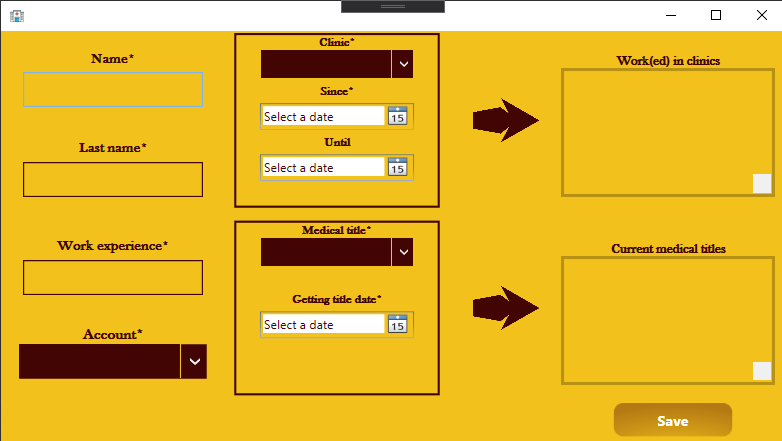
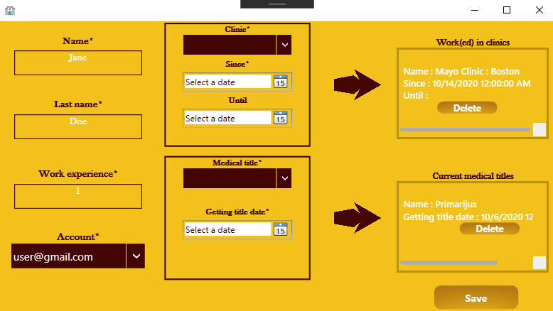
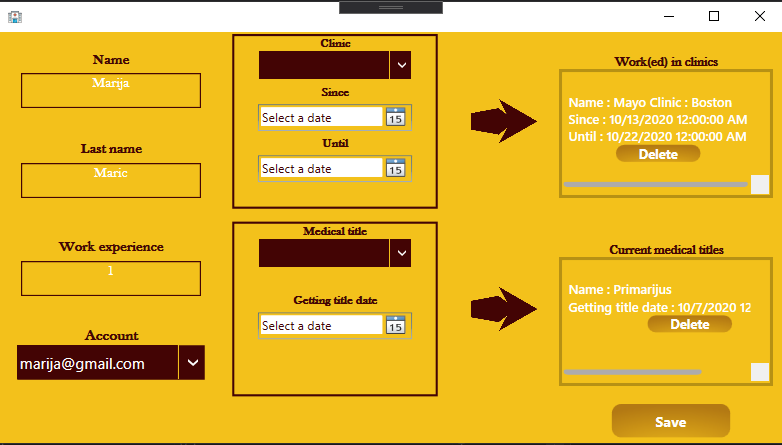
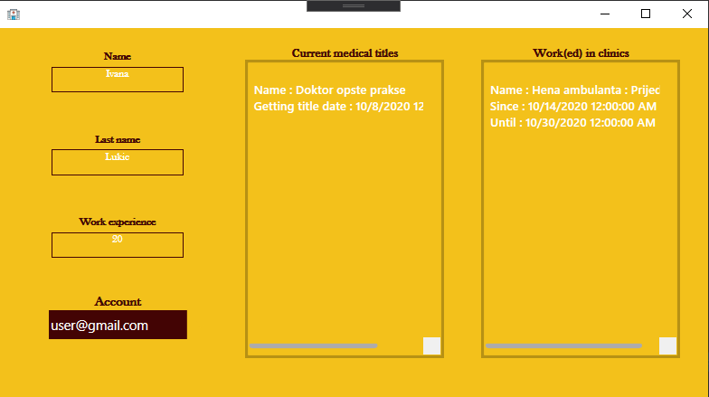

# USER INSTRUCTIONS

## Document purpose
The main purpose of this document is to explain how the application works from a user's perspective. In this document, some of the features are shown.

## Application purpose
### Aplication goal
> Goal of this application is to digitalize medical documents and organizations of the clinic and medical sector. 
> Some of the possibilities is maintaining personal health records, clinics, medical staff. 
> Application offers detailed information about the place where the patient lives, like radiation index, food quality etc. so that it can be used in diagnosing diseases and calculating statistics.
> First version of this application is the first step for medical digitalization and disease diagnostic.

### Users
The current version is adjusted for administrator workers in the medical sector (organizational and patient admins), account administrators and partially doctors (they can see medical records).
The application can support different types of users.

## INSTRUCTIONS
### Language settings
------------------------
English and Serbian are supported languages. Switching to Serbian is possible by choosing option Switch to Serbian from the main menu. Switching back to English is possible by choosing option Prevedi na engleski.
### Theme settings
----------------------
There are four supported themes (for Harry Potter fans): Ravenclaw, Slytherin, Hufflepuff and Gryffindor, which is the default theme. Unregistered users can choose theme and language, and that is why saving user settings is not currently possible, but multiple users can change the theme in parallel on the same machine. 
User can change the theme by choosing one from the dropdown menu, that is opened by clicking on option Theme from the main menu.  
  

### Login to the system
In order to access other functionalities, one must be logged in. To log in, a person must have an account in the system, and on the appropriate screen, the user enters their credentials, such as email address and password that correspond to that account. After that, the user is prompted to choose one of the roles they have on the system.  
  
By clicking on button Log in, the user will then be able to choose one of the roles. User from this example has 4 possible roles. Each role offers different functionalities.  
  
### Guide through some of the functionalities

In the next examples it will be shown how can organizational admin switch through functionalities, add, delete or create a new record. Other roles have similar options as the organizational admin, so it is the best for these examples.

After logging in on the system, the main page of organizational admin is shown. For illustration purpose, the theme is changed to Ravenclaw.  

If the user then clicks on button Doctors, a page will be displayed will table with current doctors, and buttons for adding, deleting, editing doctor and displaying details of a specific one.

In order to add a doctor, the user clicks on button Create. A new modal window that represents form is opened. From the picture, we can see that there are some fields to fill in, and some require to be added using arrows. If the user wants to input their work experience, nothing except numbers will be allowed. That is real-time validation. Some things cannot be checked instantly, so for example, if the user tries to add a doctor, and the last name is empty, then they will get the error displayed after button Save is clicked. In order to add a clinic where the doctor works, the user chooses one of the possible clinics and the date when they began working there. Util date is not necessary, and if not specified, that means that doctor works there now. Then, when data is chosen, the user clicks on the arrow next to that box. If everything goes well, the clinic will be displayed on the list in the right top corner of the form. It can be deleted from there also. To add medical title, all information must be selected. Images bellow show empty and correctly filled in the form. 
  
  
Some of the fields are not mandatory. Mandatory fields are those with *.
User can refresh the table to update its content.
When the user selects a row in a table, it can then edit, delete that row, or see details about the doctor.
For example, after the user selects the doctor that is added previously, and then clicks Details, a new modal window will be opened. 
  

### Adding a new account
As an account administrator, the user can manipulate with accounts within the application. On the main page, by clicking the button Accounts, a new page is displayed with information about existing accounts, where the administrator can see them, change current information, delete an account or add a new one.  

In order to create a proper account, a role must be chosen from the dropdown list of roles. One user can have multiple roles.

